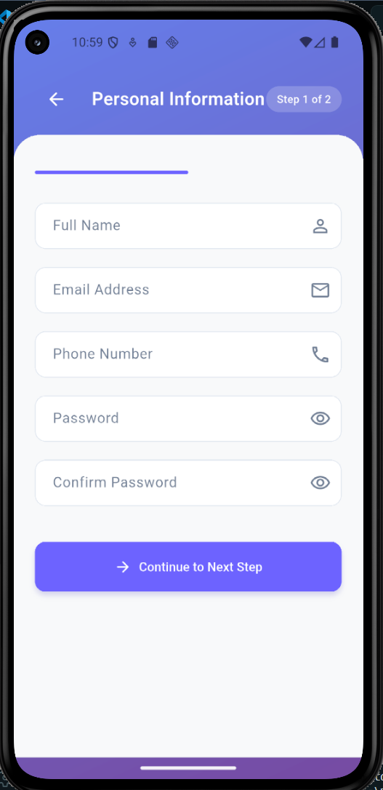
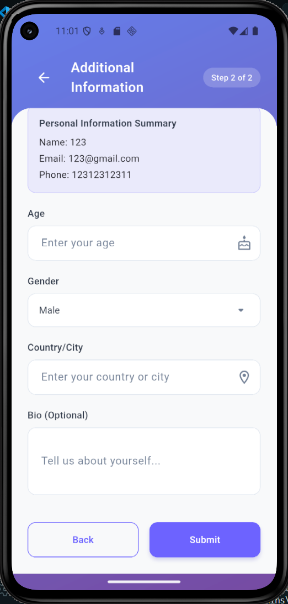
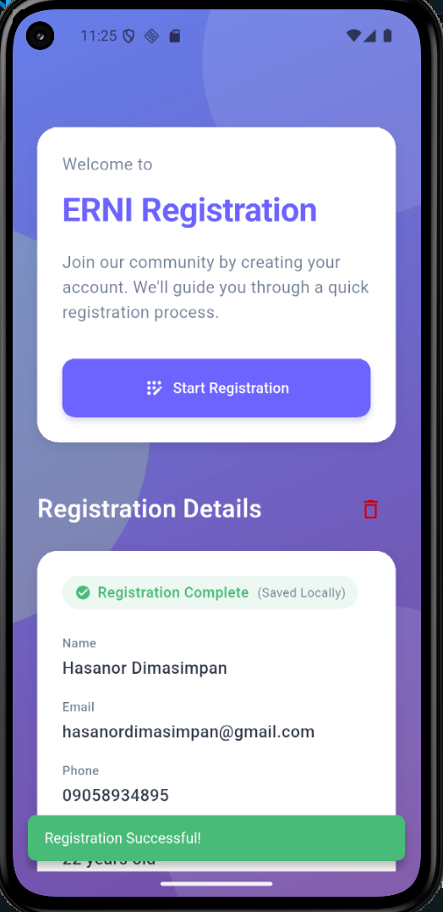
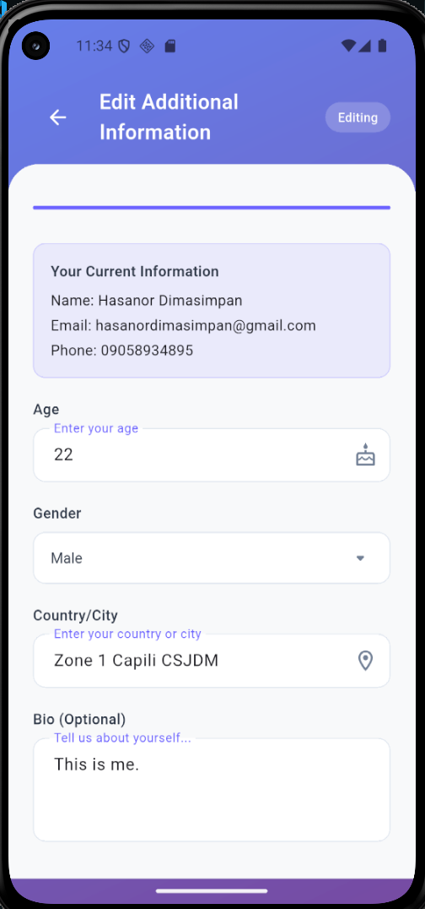
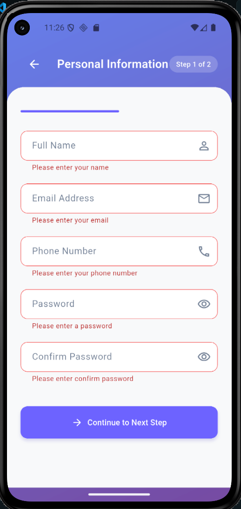
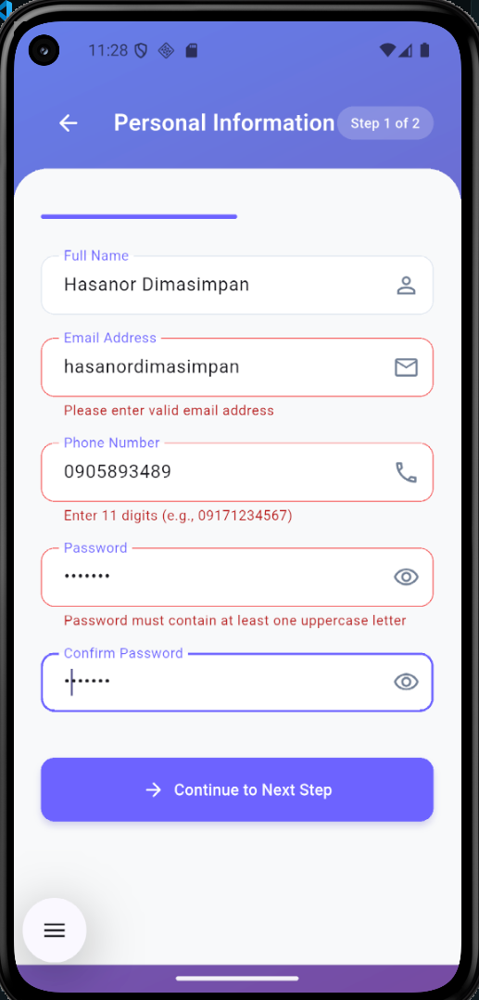
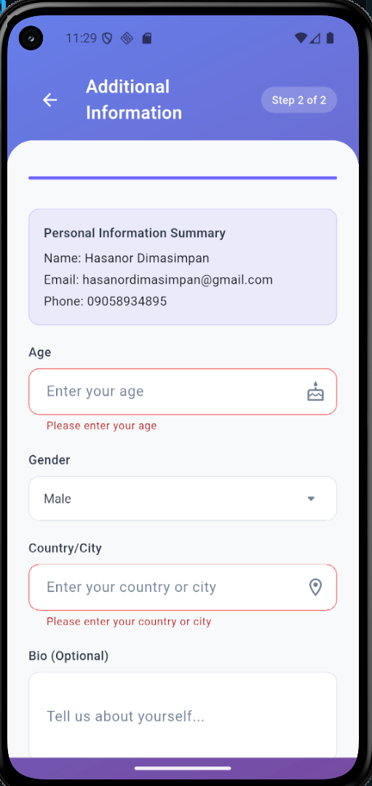
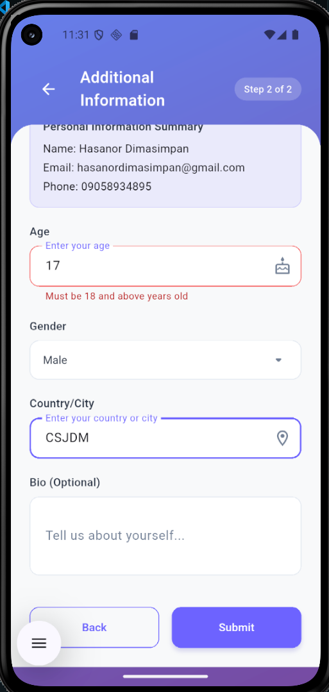

# Multi-Page Registration Form

## Description

A Flutter application demonstrating navigation and form handling across multiple screens. Users can register by filling out a two-page form with validation. The application showcases proper state management, form validation, and data passing between screens in Flutter.

## Features

- Multi-screen navigation with proper back stack management
- Comprehensive form validation on all fields with user-friendly error messages
- Data passing between screens using constructor parameters
- Password confirmation with match validation
- Age verification (must be 18 or older)
- Gender selection via radio buttons
- Responsive UI with SingleChildScrollView for small screens
- Display of submitted registration data on home screen

## Screenshots

| HomeScreen                                    | Page1                                          |
| --------------------------------------------- | ---------------------------------------------- |
|  |  |

| Page2                                          | HomeScreen when have data                      |
| ---------------------------------------------- | ---------------------------------------------- |
|  |  |

| When data is deleted                            |     |
| ----------------------------------------------- | --- |
|  |     |

### When Editing

| Page1                                          | Page2                                          |
| ---------------------------------------------- | ---------------------------------------------- |
|  |  |

#### Validation

| Page1                                          |                                                |
| ---------------------------------------------- | ---------------------------------------------- |
|  |  |

| Page2                                          |                                                |
| ---------------------------------------------- | ---------------------------------------------- |
|  |  |

## Screens

1. **Home Screen**: Welcome page with navigation to registration and display of submitted user data
2. **Registration Page 1**: Personal information form (name, email, phone, password, confirm password)
3. **Registration Page 2**: Additional information form (age, gender, country, bio)

## Validation Rules

- **Name**: Required, minimum 3 characters
- **Email**: Required, valid email format (contains '@' and '.')
- **Phone**: Required, minimum 10 digits, numeric only
- **Password**: Required, minimum 6 characters
- **Confirm Password**: Required, must match password exactly
- **Age**: Required, must be 18-59 years old, numeric only
- **Gender**: Required selection
- **Country**: Required
- **Bio**: Optional (can be empty)

## Project Structure

# Project Structure

## Main Directories

- `assets/images/` - Image files
- `lib/models/` - Data models
- `lib/screenshots/` - UI screens
- `lib/services/` - Project logic
- `lib/utils/` - Utilities

## Key Files

- `lib/main.dart` - App entry point
- `lib/models/user_model.dart` - User data model
- `lib/screens/home_screen.dart` - Home page
- `lib/screens/registration_page1.dart` - Form page 1
- `lib/screens/registration_page2.dart` - Form page 2
- `lib/services/storage_service.dart` - Storage service
- `lib/utils/constants.dart` - App constants
- `lib/utils/validation_helper.dart` - Validation helpers

## How to Run

- Clone the repository :

```bash
https://github.com/HasanorDim/registration_form
```

- Run flutter pub get
- Run flutter run
